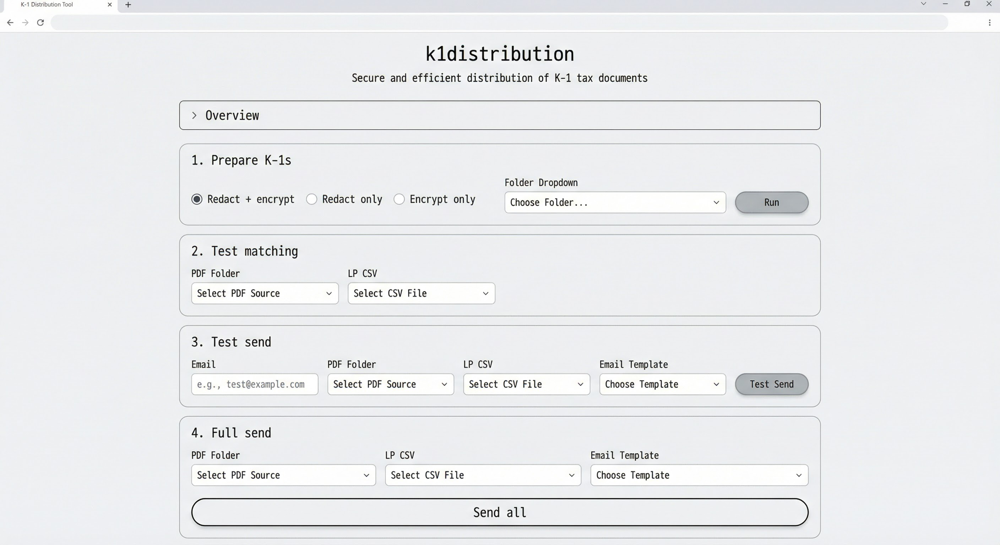

# k1distribution

Scripts to redact, encrypt, and send K-1 tax documents to limited partners. For fund managers and tax preparers.

## Setup

### 1. Install dependencies

```bash
npm install
```

Requires Node.js. Install PDFtk for encryption (or qpdf if you use redaction first):

```bash
brew install pdftk-java
```

### 2. Configure environment

Copy the example env file and edit with your values:

```bash
cp .env.example .env
```

Edit `.env` and set at minimum:

| Variable | Required for | Description |
|----------|---------------|-------------|
| `FROM_EMAIL` | Gmail, SendGrid | Sender email address |
| `FROM_NAME` | Gmail, SendGrid | Sender display name |
| `TEST_SEND_EMAIL` | Test send | Address to receive test emails |
| `SENDGRID_API_KEY` | SendGrid | SendGrid API key (if using SendGrid) |

Optional:

| Variable | Description |
|----------|-------------|
| `USE_QPDF` | Set to `1` to use qpdf instead of PDFtk (preserves fonts after redaction) |
| `CREDENTIALS_PATH` | Path to Gmail OAuth credentials (default: project root) |
| `TOKEN_PATH` | Path to Gmail OAuth token (default: project root) |
| `IGNORE_FOLDER` | Base folder for sensitive output (default: `ignore`) |
| `FONT_PATH` | Path to redaction overlay font (default: `fonts/CourierPrime-Regular.ttf`) |

### 3. Sensitive files

Keep confidential documents in the `ignore/` folder (it is gitignored):

- Put K-1 PDFs in a subfolder (e.g. `ignore/2025_fund_name/original/`)
- Place `credentials.json` and `token.json` in the project root for Gmail (they are gitignored)
- Password CSVs are written next to the fund folder (e.g. `ignore/2025_fund/k1_passwords_original.csv`)

### 4. Web UI

A minimal web interface lets you run prepare, test-match, and send operations from the browser.

**Start the UI:**

```bash
npm run ui
```

Open http://localhost:3000 (or the next available port if 3000 is in use).



**How it works:**

- **Prepare** — Choose redact only, encrypt only, or both. Select the folder containing your original PDFs (e.g. `ignore/2025_fund/original`). The UI runs the same scripts as the CLI.
- **Test matching** — Select the `_protected` or `_redacted_protected` PDF folder and LP CSV to verify each LP has exactly one matching PDF.
- **Test send** — Send one LP's K-1 to a test address. Set the test email in the UI (or it uses `TEST_SEND_EMAIL` from `.env`). Pick which LP by row number.
- **Full send** — Send all K-1s via Gmail. Requires confirmation before sending.

Dropdowns list folders and files from `ignore/` and `example/`. The UI calls the underlying Node scripts; no PDFs or passwords are sent to the browser.

**Security:**

- The UI runs on **localhost only** — it does not listen on external interfaces.
- All processing happens on your machine. The browser only sends form data (paths, options) to the local server.
- PDFs, passwords, and credentials stay on disk. The server spawns the same CLI scripts you would run manually.
- Use the UI only on a trusted machine. Do not expose the server to a network.

---

## Typical workflow

1. **Prepare** K-1 PDFs: redact (optional) and encrypt
2. **Test matching** to verify PDF filenames match your LP CSV before sending
3. **Send** K-1s via Gmail or SendGrid

---

## prepare_k1s.js (redact + encrypt)

One-step or step-by-step preparation of K-1 PDFs.

**Usage:** `npm run prepare-k1s -- <input_path>` (input path is required)

| Command | Description |
|---------|-------------|
| `npm run prepare-k1s -- ignore/2025_fund` | Redact, then encrypt (both) |
| `npm run prepare-k1s-redact -- ignore/2025_fund` | Redact only |
| `npm run prepare-k1s-encrypt -- ignore/2025_fund_redacted` | Encrypt only |

For `--both` (default): input is the original PDF folder; output is `..._redacted` then `..._redacted_protected`.

---

## redact_k1.js (optional)

Redacts the **receiving party's** SSN/TIN (the second identifier on the page) when it is currently **unredacted**. Covers the number with a white rectangle and prints the redacted form on top (e.g. `**-***0337` for TIN, `***-**-7876` for SSN). PDFs where the second identifier is already redacted are left unchanged.

**Usage:** `node redact_k1.js <input_path>`

- **input_path:** Single PDF or folder of PDFs
- **Output:** `<filename>_redacted.pdf` or `<folder>_redacted/`

Run redaction **before** encryption if you use it.

---

## k1script.js (encryption)

Encrypts K-1 PDFs with a password derived from SSN/TIN last 4 digits and ZIP code extracted from each PDF.

**Usage:** `node k1script.js [input_folder]`

- **input_folder:** Defaults to `ignore/original` if omitted
- **Output:** `<input_folder>_protected/` and `k1_passwords_<folder>.csv` (saved in the parent of the input folder)

**Encryption tool:** PDFtk (default) or qpdf. Set `USE_QPDF=1` in `.env` to use qpdf (preserves fonts after redaction). Install with `brew install qpdf`.

---

## test_k1s.js

Tests that each LP in your CSV has exactly one matching PDF (by filename). Run before sending.

**Usage:** `node test_k1s.js <pdf_folder> [lp_csv]`

- **pdf_folder:** Folder containing K-1 PDFs (e.g. the `_protected` folder)
- **lp_csv:** Defaults to `lp_list.csv`

Output: `matching_results.csv` next to the LP CSV.

---

## Sending K-1s (Gmail and SendGrid)

You need: email template, K-1 PDFs, and LP CSV.

### LP CSV format

```csv
identifier,email
LP001,john.doe@example.com
ACME_LLC,contact@acme.com
"ACME LLC",contact@acme.com;finance@acme.com
```

- **identifier** must match part of the K-1 PDF filename
- Use semicolons (`;`) for multiple emails per LP
- Wrap values with commas in double quotes

See `example_list.csv` for a sample.

### Email template

First line: `SUBJECT: Your subject`. Remaining lines: body. See `email_template.txt` for a template.

### Gmail

```bash
node send_k1s_gmail.js <pdf_folder> [lp_csv] [email_template]
```

**Setup:**

1. Google Cloud Console: create OAuth credentials, download as `credentials.json`
2. Place `credentials.json` in the project root (gitignored)
3. First run: authorize in browser, paste code; creates `token.json` in project root

### Test send (Gmail)

Send one LP's K-1 to `TEST_SEND_EMAIL` to review before full send:

```bash
node send_k1s_gmail_test.js <pdf_folder> [lp_csv] [email_template] [lp_pick]
```

`lp_pick`: number (1-based) or part of identifier.

### SendGrid

```bash
node send_k1s_sendgrid.js <pdf_folder> [lp_csv] [email_template]
```

Requires `SENDGRID_API_KEY` in `.env`. Authenticate your domain in SendGrid to avoid spoof warnings.

---

## npm scripts

| Script | Description |
|--------|-------------|
| `npm run prepare-k1s -- <path>` | Redact + encrypt |
| `npm run prepare-k1s-redact -- <path>` | Redact only |
| `npm run prepare-k1s-encrypt -- <path>` | Encrypt only |
| `npm run redact -- <path>` | Redact (direct) |
| `npm run encrypt -- [path]` | Encrypt (direct) |
| `npm run test-match -- <pdf_folder> [lp_csv]` | Test PDF/LP matching |
| `npm run send-gmail -- ...` | Send via Gmail |
| `npm run send-gmail-test -- ...` | Test send via Gmail |
| `npm run send-sendgrid -- ...` | Send via SendGrid |
| `npm run ui` | Start web interface (localhost:3000) |

Pass arguments after `--`.

---

## Confidentiality

The repo's `.gitignore` includes:

- `ignore/` – K-1 PDFs, password CSVs
- `credentials.json`, `token.json` – Gmail OAuth (project root)
- `.env` – environment variables

Never commit these files.
